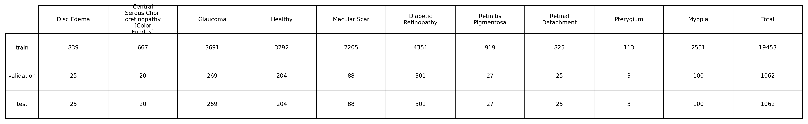
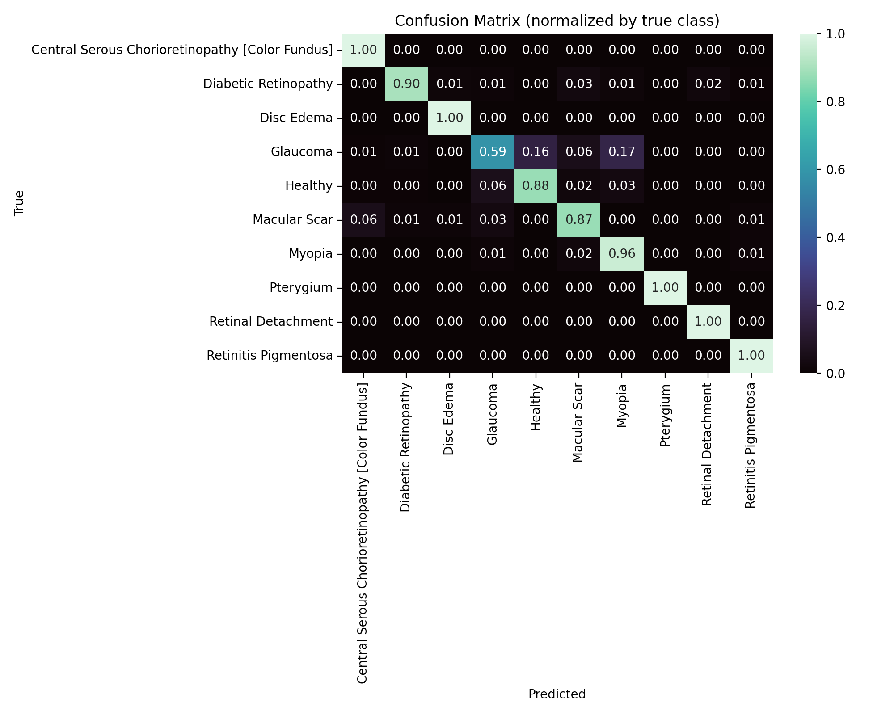
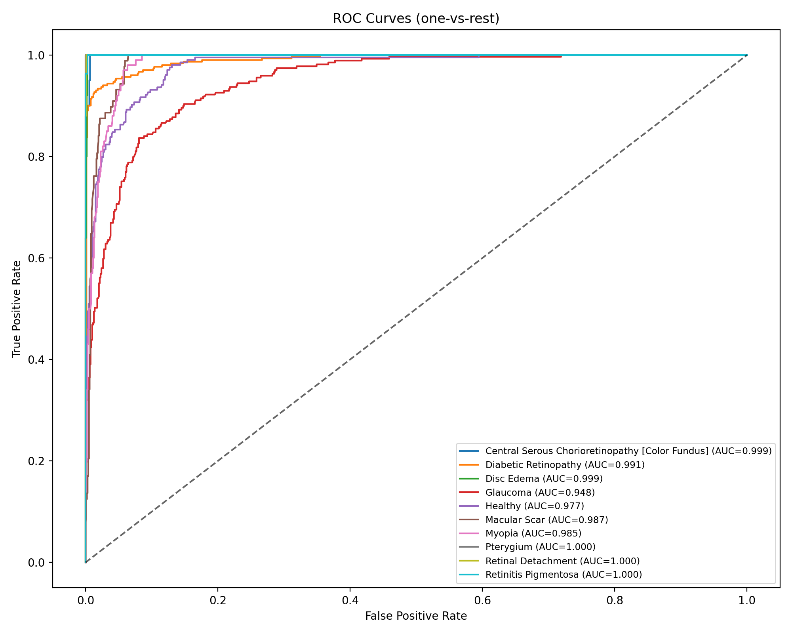
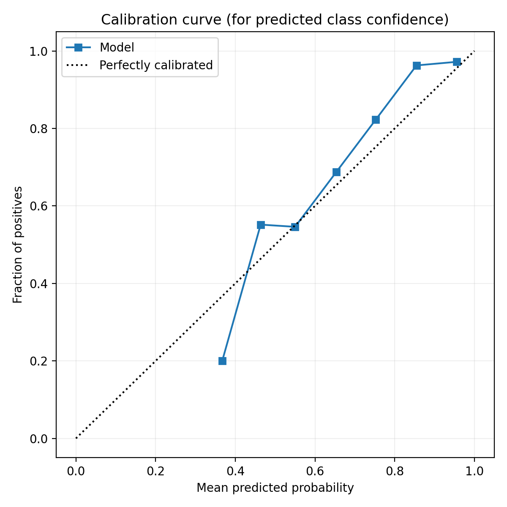
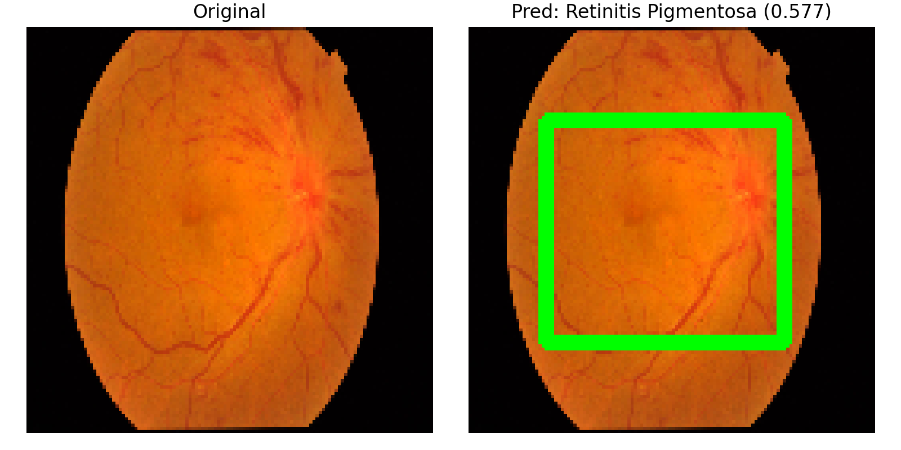
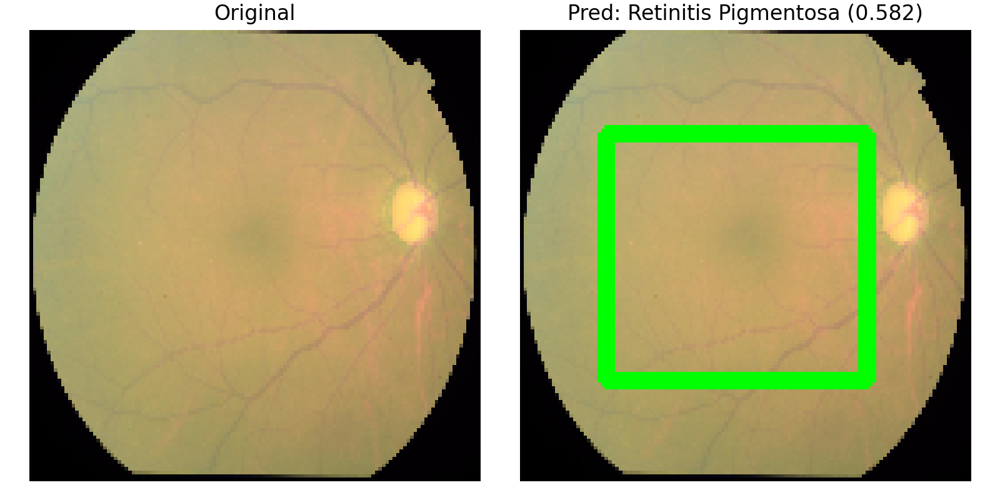

# Eye Disease Detection Using Deep Learning

[![TensorFlow]
[![Python]
[![Jupyter]

An advanced deep learning project for automated detection and classification of 10 different eye diseases using convolutional neural networks and real-world medical imaging data.

## Project Overview

This project implements a state-of-the-art eye disease detection system capable of identifying 10 distinct ocular conditions with high accuracy. The system leverages transfer learning with SE-ResNet architecture and comprehensive data augmentation techniques to achieve robust performance on real-world medical images.

### Detected Eye Conditions

- **Central Serous Chorioretinopathy** - Fluid accumulation under retina
- **Diabetic Retinopathy** - Diabetes-related retinal damage  
- **Disc Edema** - Optic nerve swelling
- **Glaucoma** - Optic nerve damage from eye pressure
- **Healthy Eyes** - Normal eye condition
- **Macular Scar** - Retinal scarring in central vision
- **Myopia** - Nearsightedness complications
- **Pterygium** - Growth on eye surface
- **Retinal Detachment** - Retina separation from eye wall
- **Retinitis Pigmentosa** - Progressive vision loss

## Dataset Distribution



The dataset comprises **21,577 total images** distributed across training, validation, and test sets:
- **Training**: 19,453 images (90.1%) - Enhanced with augmented data
- **Validation**: 1,062 images (4.9%) - Original images only
- **Test**: 1,062 images (4.9%) - Original images only

## Model Architecture


The model utilizes **SE-ResNet (Squeeze-and-Excitation ResNet)** with the following specifications:
- **Input Size**: 144×144×3 RGB images
- **Batch Size**: 64
- **Architecture**: Transfer learning with fine-tuned SE-ResNet backbone
- **Output**: 10-class softmax classification
- **Optimization**: GPU-accelerated training on Apple M1 Pro

## 🎯 Performance Results

### Overall Metrics
- **Test Accuracy**: **82.96%**
- **Balanced Accuracy**: **92.00%** 
- **Top-2 Accuracy**: **97.46%**
- **Top-3 Accuracy**: **99.06%**
- **Expected Calibration Error**: **4.57%**

### Detailed Classification Performance

| Disease Class | Precision | Recall | F1-Score | Support |
|---------------|-----------|---------|----------|---------|
| Central Serous Chorioretinopathy | 68.97% | 100.00% | 81.63% | 20 |
| **Diabetic Retinopathy** | **98.19%** | **90.03%** | **93.93%** | **301** |
| Disc Edema | 83.33% | 100.00% | 90.91% | 25 |
| Glaucoma | 89.27% | 58.74% | 70.85% | 269 |
| Healthy | 80.27% | 87.75% | 83.84% | 204 |
| Macular Scar | 71.96% | 87.50% | 78.97% | 88 |
| Myopia | 62.34% | 96.00% | 75.59% | 100 |
| **Pterygium** | **100.00%** | **100.00%** | **100.00%** | **3** |
| Retinal Detachment | 78.12% | 100.00% | 87.72% | 25 |
| **Retinitis Pigmentosa** | **87.10%** | **100.00%** | **93.10%** | **27** |

## 📈 Visual Analysis

### Confusion Matrix


### ROC Curves


### Model Calibration


### GradCAM Visualizations
The model provides explainable AI through GradCAM heatmaps showing decision regions:




## Quick Start

### Installation
```bash
git clone https://github.com/muhammad-o98/eye_disease_detection.git
cd eye_disease_detection
pip install -r requirements.txt
```

### Usage
```python
# Load and run the main training notebook
Jupyter notebook build.ipynb

# Or explore model evaluation
jupyter notebook see.ipynb
```

## 📁 Project Structure
```
eye_disease_detection/
├── build.ipynb              # Main training pipeline
├── see.ipynb                 # Model evaluation and analysis
├── requirements.txt          # Dependencies
├── evaluation_outputs/       # Model results and visualizations
├── dataset_summary_fixed_wrapped_total.png
└── se_resnet_cnn.png        # Architecture diagram
```

## 💡 Key Features

- ** High Accuracy**: 82.96% overall accuracy with 92% balanced accuracy
- ** GPU Optimized**: Apple M1 Pro Metal acceleration
- ** Explainable AI**: GradCAM visualizations for model interpretability
- ** Comprehensive Evaluation**: Multiple metrics and calibration analysis
- ** Data Augmentation**: Enhanced training with augmented medical images
- ** Class Balance**: Weighted approach handling imbalanced medical data

## Technical Implementation

The project employs advanced computer vision techniques, including transfer learning, data augmentation, and model calibration, to achieve state-of-the-art performance in medical image classification. The SE-ResNet architecture with attention mechanisms provides superior feature extraction for complex medical imaging patterns.

## Dependencies

Key technologies: TensorFlow, Keras, OpenCV, Matplotlib, Pandas, NumPy, Scikit-learn

---
